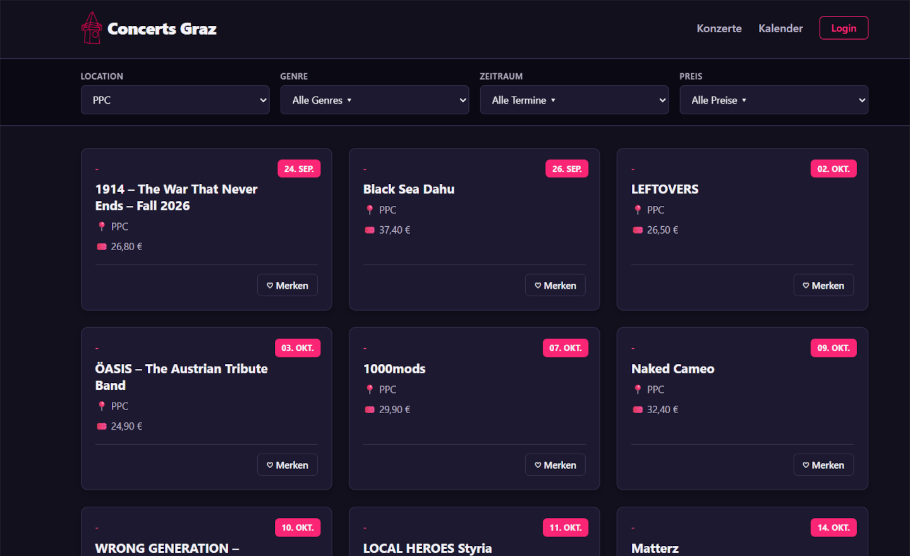
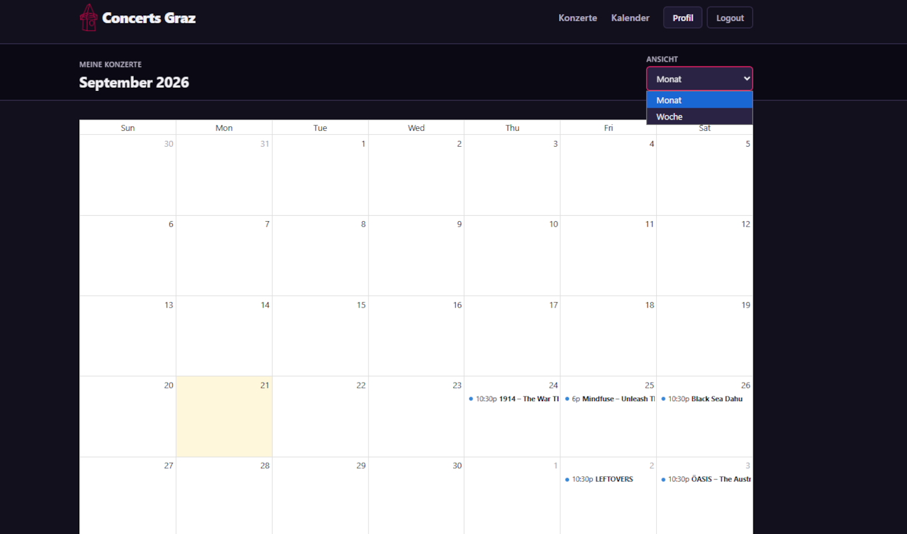
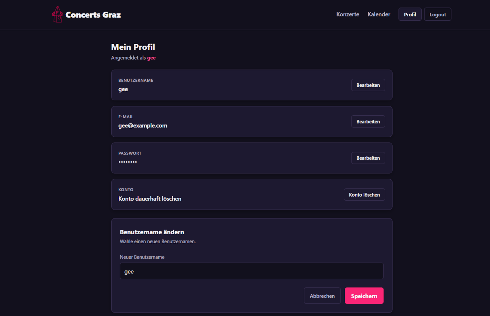

# CS Concert Calendar Webscraper

A web application prototype that collects concert data from selected websites through web scraping and displays upcoming events in a structured concert calendar.

The project was developed as my final project during my **Application Development – Coding** training at Schulungszentrum Fohnsdorf.

## Features

* Web scraping of concert and event data
* Structured storage of scraped concert information
* Concert overview and calendar
* Monthly calendar navigation
* Filtering and displaying upcoming events
* ASP.NET Core web interface

* ## Screenshots

#### Concert Overview

#### Calendar View

#### Profile View

## Technologies

* **C#**
* **ASP.NET Core**
* **HTML / CSS / JavaScript / FullCalendar**
* **MongoDB**
* **Web Scraping (HTML Agility Pack)**
* **Git / GitHub**

## How it works

The application retrieves concert information from selected event websites using web scraping.

Relevant information such as the event name, date, venue and other available details is extracted and converted into a consistent data structure.

The collected data is stored in MongoDB and used by the ASP.NET Core application to display upcoming concerts in a clear and accessible format.

## Project Structure

The application separates the main responsibilities into different components:

* **Scraping** – retrieves and extracts concert data from external websites
* **Data processing** – converts scraped information into structured concert objects
* **Database** – stores the collected concert data in MongoDB
* **Web application** – provides the user interface and concert calendar

## Purpose

The main goal of this project was to combine several topics covered during my training in one practical project, including:

* object-oriented programming with C#
* working with databases
* processing external data
* structuring a larger software project
* web development with ASP.NET Core
* web scraping

The current version demonstrates the core workflow:

Web Scraping → Data Processing → MongoDB → ASP.NET Core Web Application

The project is not yet production-ready.

### Possible Future Improvements

- Replace the current persistence solution
- Add additional scraping sources
- Improve error handling and validation
- Improve the user interface
- Add media previews for concerts and artists
- Add genre extractor
- Deployment
